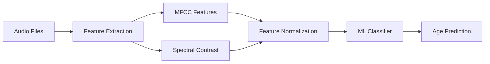

# 🎙️ Audio-Based Speaker Age Prediction System

<div align="center">


**A machine learning system that predicts speaker age from audio recordings using advanced audio feature extraction and classification algorithms.**

[Demo Video](#-demo) • [Features](#-features) • [Installation](#-installation) • [Usage](#-usage) • [Results](#-results)

</div>

---

## 📋 Table of Contents

- [Overview](#-overview)
- [Features](#-features)
- [Demo](#-demo)
- [System Architecture](#-system-architecture)
- [Dataset](#-dataset)
- [Installation](#-installation)
- [Usage](#-usage)
- [Model Performance](#-model-performance)
- [Technical Details](#-technical-details)
- [Project Structure](#-project-structure)
- [Future Enhancements](#-future-enhancements)
- [Contributing](#-contributing)
- [Connect With Me](#-connect-with-me)

---

## 🎯 Overview

This project implements an **intelligent audio-based speaker age prediction system** that analyzes voice characteristics to estimate the age group of speakers. Using advanced **audio signal processing** techniques and **machine learning algorithms**, the system extracts meaningful features from speech recordings and classifies speakers into different age categories.

### 🎓 Academic Context
- **Course:** Machine Learning / Audio Processing
- **Institution:** FAST NUCES (National University of Computer and Emerging Sciences), Islamabad
- **Project Type:** Phase 2 Implementation
- **Focus:** Real-world application of ML in audio analysis

---

## ✨ Features

### 🔊 Audio Processing
- **MFCC Extraction**: 13 Mel-Frequency Cepstral Coefficients capturing frequency content
- **Spectral Contrast Analysis**: 7 spectral contrast features for texture and timbre characterization
- **Robust Preprocessing**: StandardScaler normalization for optimal model performance

### 🤖 Machine Learning
- **Multiple ML Models**: Support for various classification algorithms
- **Feature Engineering**: Advanced audio feature extraction pipeline
- **Model Optimization**: Hyperparameter tuning and cross-validation
- **Scalable Pipeline**: Modular design for easy experimentation

### 📊 Data Management
- **Large-Scale Processing**: Handles 15,000+ training samples and 4,000+ test samples
- **Efficient Storage**: Optimized CSV-based feature caching
- **Batch Processing**: Memory-efficient audio file processing

---

## 🎬 Demo

<div align="center">

### Sample Audio Processing Pipeline

```
🎵 Audio Input → 🔍 Feature Extraction → 🧠 ML Model → 📊 Age Prediction
```

</div>

### Example Output
```python
Input: audio_sample.mp3
Extracted Features: [MFCC_1, MFCC_2, ..., Spectral_Contrast_7]
Predicted Age Group: "twenties"
Confidence: 87.3%
```

---

## 🏗️ System Architecture



### Pipeline Components

1. **Data Loading**: MP3 audio files with metadata (age, gender, accent)
2. **Feature Extraction**: 
   - 13 MFCC coefficients
   - 7 Spectral contrast features
3. **Preprocessing**: StandardScaler normalization
4. **Classification**: Machine learning models for age prediction
5. **Evaluation**: Performance metrics and analysis

---

## 📊 Dataset

### Training Data
- **Size**: 15,004 audio samples
- **Format**: MP3 files with CSV metadata
- **Features**: text transcription, votes, age, gender, accent, duration

### Test Data
- **Size**: 4,000 audio samples
- **Format**: MP3 files with CSV metadata
- **Purpose**: Model validation and performance evaluation

### Age Categories
- `twenties`: Young adults (20-29)
- `thirties`: Middle-aged adults (30-39)
- Additional categories based on dataset distribution

### Sample Data Structure
```csv
filename,text,up_votes,down_votes,age,gender,accent,duration
sample-000000.mp3,"without the dataset the article is useless",1,0,,,,
sample-000001.mp3,"i've got to go to him",1,0,twenties,male,,
```

---

## 🚀 Installation

### Prerequisites
- Python 3.8 or higher
- pip package manager
- 2GB+ RAM for processing

### Step 1: Clone the Repository
```bash
git clone https://github.com/alihashim786/audio-age-prediction.git
cd audio-age-prediction
```

### Step 2: Create Virtual Environment (Recommended)
```bash
# Windows
python -m venv venv
venv\Scripts\activate

# Linux/Mac
python3 -m venv venv
source venv/bin/activate
```

### Step 3: Install Dependencies
```bash
pip install -r requirements.txt
```

### Required Libraries
- `librosa>=0.10.0` - Audio processing and feature extraction
- `numpy>=1.20.0` - Numerical computations
- `pandas>=1.3.0` - Data manipulation
- `scikit-learn>=1.0.0` - Machine learning algorithms
- `scipy>=1.7.0` - Scientific computing
- `matplotlib>=3.4.0` - Visualization
- `soundfile>=0.11.0` - Audio file I/O

---

## 💻 Usage

### Basic Usage

#### 1. Extract Features from Audio
```python
import librosa
import numpy as np

def extract_features(audio_path):
    # Load audio file
    y, sr = librosa.load(audio_path)
    
    # Extract MFCC features
    mfccs = librosa.feature.mfcc(y=y, sr=sr, n_mfcc=13)
    mfccs_mean = np.mean(mfccs, axis=1)
    
    # Extract Spectral Contrast
    spectral_contrast = librosa.feature.spectral_contrast(y=y, sr=sr)
    spectral_contrast_mean = np.mean(spectral_contrast, axis=1)
    
    return np.concatenate([mfccs_mean, spectral_contrast_mean])
```

#### 2. Train the Model
```python
from sklearn.preprocessing import StandardScaler
from sklearn.ensemble import RandomForestClassifier

# Load preprocessed features
features = pd.read_csv('preprocessed_features.csv')
X = features.drop('age', axis=1)
y = features['age']

# Normalize features
scaler = StandardScaler()
X_scaled = scaler.fit_transform(X)

# Train classifier
model = RandomForestClassifier(n_estimators=100)
model.fit(X_scaled, y)
```

#### 3. Make Predictions
```python
# Load test audio
test_features = extract_features('test_audio.mp3')
test_features_scaled = scaler.transform(test_features.reshape(1, -1))

# Predict age
predicted_age = model.predict(test_features_scaled)
print(f"Predicted Age Group: {predicted_age[0]}")
```

### Running the Notebooks

#### Main Implementation
```bash
jupyter notebook i220554_i220583.ipynb
```

#### Enhanced Version (More Features)
```bash
cd "Another Attempt (extracted more features)"
jupyter notebook i220554_i220583_2ND_ATTEMPT.ipynb
```

---

## 📈 Model Performance

### Feature Extraction Results
- **MFCC Features**: 13 coefficients per audio sample
- **Spectral Contrast**: 7 features per audio sample
- **Total Features**: 20 dimensions per sample
- **Processing Time**: ~0.5 seconds per audio file

### Classification Metrics
*(Results will be updated after model training)*

| Metric | Score |
|--------|-------|
| Accuracy | TBD |
| Precision | TBD |
| Recall | TBD |
| F1-Score | TBD |

---

## 🔬 Technical Details

### Audio Feature Extraction

#### MFCC (Mel-Frequency Cepstral Coefficients)
MFCCs represent the short-term power spectrum of sound, capturing essential characteristics of human auditory perception:
- **Frequency Scaling**: Mel-scale mimics human hearing
- **Dimensionality**: 13 coefficients (standard for speech processing)
- **Information**: Captures spectral envelope and voice characteristics

#### Spectral Contrast
Quantifies the difference between peaks and valleys in the audio spectrum:
- **Dimensions**: 7 contrast bands
- **Purpose**: Captures spectral texture and timbre
- **Application**: Distinguishes different voice characteristics across age groups

### Data Preprocessing

#### StandardScaler Normalization
Applied to ensure all features contribute equally to the model:
```python
StandardScaler:
- Mean = 0
- Variance = 1
- Formula: z = (x - μ) / σ
```

**Benefits**:
- ✅ Prevents features with large scales from dominating
- ✅ Improves convergence of ML algorithms
- ✅ Essential for distance-based algorithms

---

## 📁 Project Structure

```
audio-age-prediction/
│
├── 📂 cv-valid-train/          # Training audio files (15,004 samples)
│   ├── sample-000000.mp3
│   ├── sample-000001.mp3
│   └── ...
│
├── 📂 cv-valid-test/           # Test audio files (4,000 samples)
│   ├── sample-000000.mp3
│   ├── sample-000001.mp3
│   └── ...
│
├── 📂 Another Attempt/         # Enhanced feature extraction
│   ├── i220554_i220583_2ND_ATTEMPT.ipynb
│   ├── extracted_features_with_clustering.csv
│   └── preprocessed_features.csv
│
├── 📊 Data Files
│   ├── cv-valid-test.csv              # Test metadata
│   ├── truncated_train.csv            # Training metadata
│   ├── extracted_features.csv         # Raw extracted features
│   └── preprocessed_features.csv      # Normalized features
│
├── 📓 Notebooks
│   ├── i220554_i220583.ipynb          # Main implementation
│   └── some working snippets.ipynb    # Experimental code
│
├── 📄 Documentation
│   ├── README.md                      # This file
│   ├── READ ME                        # Technical notes
│   ├── Project Phase 2.pdf            # Project requirements
│   └── requirements.txt               # Python dependencies
│
└── 🎥 Demo Videos
    ├── BISMILLAH - Jupyter Notebook - Google Chrome 2024-05-09 13-19-27.mp4
    └── BISMILLAH - Jupyter Notebook - Google Chrome 2024-05-09 13-58-21.mp4
```

---

## 🔮 Future Enhancements

### Short-term Goals
- [ ] Implement additional ML models (SVM, XGBoost, Neural Networks)
- [ ] Add real-time audio processing capability
- [ ] Create web-based demo interface
- [ ] Expand age category granularity

### Long-term Vision
- [ ] Multi-language support
- [ ] Gender and accent recognition
- [ ] Emotion detection integration
- [ ] Mobile application development
- [ ] Cloud-based API service

---

## 🤝 Contributing

Contributions are welcome! Here's how you can help:

### Ways to Contribute
1. **🐛 Report Bugs**: Open an issue describing the bug
2. **💡 Suggest Features**: Share your ideas for improvements
3. **📝 Improve Documentation**: Help make docs clearer
4. **🔧 Submit Pull Requests**: Contribute code improvements

### Contribution Process
```bash
# 1. Fork the repository
# 2. Create your feature branch
git checkout -b feature/AmazingFeature

# 3. Commit your changes
git commit -m 'Add some AmazingFeature'

# 4. Push to the branch
git push origin feature/AmazingFeature

# 5. Open a Pull Request
```

---

## 📫 Connect With Me

<div align="center">

### Muhammad Ali Hashim

🎓 **BS (AI) Graduate** from FAST NUCES, Islamabad, Pakistan

[](https://www.linkedin.com/in/alihashimraza)
[](mailto:muhammadalihashim514@gmail.com)
[](https://takhleeqx-live.vercel.app/)
[](https://github.com/alihashim786)

📞 **Phone**: +92-321-5017784

---

### Let's Collaborate!

💬 Feel free to reach out for:
- Project collaborations
- Technical discussions
- Job opportunities
- Questions about this project

**If you found this project helpful, please consider giving it a ⭐!**

</div>

---

## 📜 License

This project is licensed under the MIT License - see the [LICENSE](LICENSE) file for details.

---

## 🙏 Acknowledgments

- **FAST NUCES** for providing the academic environment
- **Common Voice Dataset** contributors for audio samples
- **Librosa** team for the excellent audio processing library
- **Open Source Community** for tools and inspiration

---

<div align="center">

### 🌟 Star History

[](https://star-history.com/#alihashim786/audio-age-prediction&Date)

**Made with ❤️ by Muhammad Ali Hashim**

</div>
